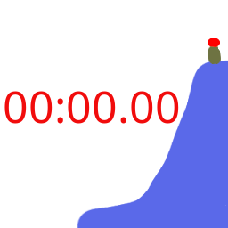

# McTech Ninja Timing System
A cool recreation of the ninja timing and leaderboard system I made just for fun in 2 days while at Worlds!

#### If you have any inquiries or need help, contact me at mctechdev@icloud.com.
____
<br />

## How to use it

If you know how to create a Python Flask webserver and how to deploy it, you probably know how to use this program lol, but I'm making a full-fledged tutorial for people who don't know how to do any of that.

#### NOTE: This will need to be run on a computer or laptop.

### Table Of Contents (If you are on Windows and want a WAAAY easier experience, I HIGHLY suggest going to [Running the prebuilt app](#running-the-prebuilt-app))
<br />

[How to install Python (Skip if you are using the EXE)](#python-installation)

[Installing The Dependencies (Skip if you are using the EXE)](#installing-the-dependencies-and-running-it)

[Configuring The System](#configuring-the-system)

[How To Control It and Use the Leaderboard](#how-to-control-it-and-use-the-leaderboard)


[Gallery](#gallery)
* [The Pages](#pages)
* [My Setup](#my-irl-setup)
____
____
<br />

____
____

## Running The Prebuilt App

If you are using Windows and don't want to go to all the trouble of installing everything, go to [the latest release](https://github.com/YourFurryDeveloper/McTech-Ninja-Timing-System/releases/tag/V1.1.4) and click McTechDev-App-Windows.zip.

Once you have downloaded the zip file, unzip it and then go into the `McTechDev-App` folder (it may be nested inside another folder, depending on how you unzipped it.), and then just double-click `McTech-Ninja-Timing-System.exe` to run it, and it will probably give you a popup, but I SWEAR I didn't make a virus (the popup would be red), I just don't want to pay hundreds of dollars for a liscence. Just click `more info`, then `run anyway`. BOOM! MUCH easier!

Then go to [Configuring The System](#configuring-the-system) to learn how to configure the system.

Note that you WILL NOT need to do any of the other steps except for configuring it and how to control it, as the whole program has been bundled and made MUCH easier for you.
____
____
<br />

### Python Installation

First, go to the [Python download page](https://python.org/downloads), and click the button that says `'Download Python X.XX.X'` (As of right now, it is 3.13.5.)

Once you have downloaded it, install it (obviously), and just use and follow all the default instructions and settings in the installer.
____
<br />

### Installing The Dependencies And Running It

Now that you have downloaded and installed Python, you will need to install the project and its dependencies.

First, click the green `Code` button located above the file container, and click `Download ZIP`.

Once you have the zip file downloaded, unzip it. (Double click the file on MacOS, and right click on the file and click `Extract All` on Windows.)

<br />
Now comes the 'hard' part for some of you (no offense, sorry 😭😭😭)

If you're on MacOS, click the command button and space bar (together) and type in `Terminal`. Open terminal.

If you're on Windows, press the Windows key and R (together) and type in `cmd`, then press enter.

<br />

Now, with Terminal/CMD open in the background, open Finder/File Explorer and find the unzipped folder with the files that you downloaded, but don't go into the folder. If you're on Windows, there may be a folder inside the folder, you want to use the one inside the folder for this next step.

Go back to Terminal and type cd and then a space, but don't press enter. Drag the folder of the project into Terminal, and now it should look something like `cd /path/to/the/folder/`. Press enter.

Once you have done that, type `pip install -r requirements.txt` into the terminal. This will install the dependencies needed to run the project. (If that says `pip: command not found`, then type `python3 -m pip install -r requirements.txt` instead.)

When it's finished, all you have to do is type `python3 server.py`, and it should be all ready to go!
____
<br />

### Configuring The System

When you run the program by terminal (if you're using the long way), or double-clicking on the exe (if you're using the pre-bundled app), you will see an output like this:

```
WARNING: This is a development server. Do not use it in a production deployment. Use a production WSGI server instead.
 *Running on all addresses (0.0.0.0)
 *Running on http://127.0.0.1:49152
 *Running on http://10.0.0.150:49152
```

Where it says `Running on http://10.0.0.150:49152`, you will see something other than `10.0.0.150`. This is the address of the timing system. Open that URL in a browser on any device (preferably a computer). You will see the leaderboard!

To configure it though, go to that URL and add /config to it. You will see a configuration screen.

Fill out all the text boxes with the name of the competition, the division, and the name of the course. Once you have done that, select the course type.

Once you have selected the course type, change the time limit (there will be no time limit box if you set the course type to stopwatch.) Enter the amount of minutes or seconds you want the limit to be. As of right now, if you have it set to minutes, the amount of minutes you can put in HAS to be an integer, NOT a floating point value such as a decimal. If you want to get more specific, change it to seconds, then enter the time you want in seconds. Sorry for the inconvenience. :3

Once this is finished, scroll down to where it says Obstacles and click `Add obstacle`. Add all the obstacles in the course in the order that you want them to be run.

Go down to the Competitors section, and repeat the same process as adding obstacles, but instead, fill out the competitor's info. The order you add them is the run order.

Once you are finished, click the button at the top of the page that says `Push and save all configs`, and a popup will appear. It will dissappear once everything has been saved.

Congratulations! You are ready to run the course!
____
<br />

### How To Control It and Use the Leaderboard

Here is a list of all the URLS that the system has. (append these to the end of the URL you got from the command output.)

* / (This is the main leaderboard, you can open this on a computer or TV for the best viewing experience.)
* /controller (This is the endpoint that you will open on a phone to control the system.)
* /config (The page you just used to configure the system.)
* /timer (Open this on another device if you want, this is the actual timer display, like the ones that hang from the rigs at Worlds.)
* /buzzer (I highly reccomend opening this on a second phone and setting it where the finish will be. It is literally just a big red buzzer button.)
* /overlay (This page is for if you are streaming and want a stream overlay. It shows the timer, the competitor's name and division. You can chroma key it out in software like OBS.)

On the /controller page, you will see 6 buttons.
* Fail
* Finish (To manually finish if you aren't using /buzzer on another device at the end of the course.)
* Start (Starts the timer with NO COUNTDOWN)
* Obstacle (Press this when the runner completes an obstacle.)
* Pause (Pauses the timer)
* Resume (Resumes the timer)

<br />

At the beginning of the course, press start. This will start the timer with no countdown.

When the competitor completes an obstacle, press obstacle.

To pause and resume the time, use those buttons.

If you aren't using a second phone as the buzzer, then just press finish when the runner completes the course or fail if they fall or fail to complete it depending on what kind of course you are doing. If they run out of time, they will automatically be failed.

<br />

#### If you have any inquiries or need help, contact me at mctechdev@icloud.com.

____
____
<br />
<br />

## Gallery

### Pages
|  |  |
|----|----|
|  |  |
|  |

<br />

### My IRL setup
I use my phone for the controls, an iPhone 5S on a tripod for the buzzer, my Mac or TV for the leaderboard, and a Raspberry Pi in a SmartPiTouch case running FullPageOS for the timer!

|  |  |
|----|----|
|  |  |
